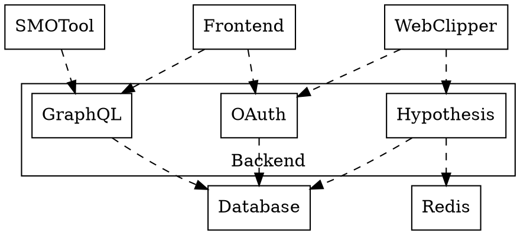
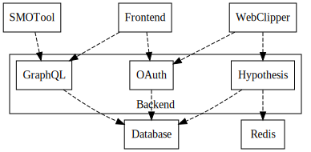
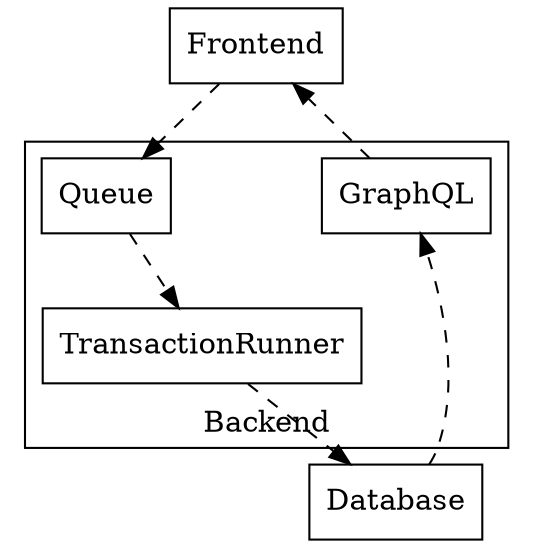
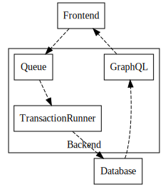

[TOC]

Major components
===

In terms of production deployment, there are the following components in Sense.tw:

* Sensemap frontend
* Web clipper
* Sensemap backend
* SMO tool

## Architectural picture

Note: Consult Yen-Wen Chen for production Redis deployment.

## SMO tool

SMO tool serves a vaild XML documents with [Open Graph protocol](http://opengraphprotocol.org/) information for social media optimization purposes.

The endpoint of SMO tool accepts exactly the same URL path as the Sensemap frontend.  It is the responsibility of cloud deployment to redirect traffics from social media bots to this endpoint.

SMO tool requests data from the GraphQL endpoint of Sensemap backend to build the XML outputs.

## Sensemap frontend

Sensemap frontend serves the user-facing [Sense.tw](http://sense.tw/) interface.

Sensemap frontend communicates with the GraphQL endpoint of backend.  It also directs users to the OAuth endpoint for user sign up and login.

## Web clipper

Web clipper provides the sidebar for annotations when user is browsing a 3rd-party web page.

Web clipper serves the sidebar with the [Via proxy service](https://via.sense.tw/): for users wishing to visit a web page with URL <http://SOME_URL>, they will direct the browser to <https://via.sense.tw/SOME_URL> to receive the same web page through the Via proxy.  Via proxy inserts JavaScript code for the annotation sidebar, and also replaces all the links in the web page with the ones with Via proxy prefix.

The inserted code communicates with the Hypothesis endpoint of Sensemap backend.  It also communicates with the OAuth endpoint for user sign up and login.

### Loading annotation sidebar

The loading of annotation sidebar is somewhat convoluted and is explained here for the lack of a specific location for its documentation currently.

There are two pieces of code served by the Hypothesis endpoint of backend to provide annotation sidebar:

* The boot code for bundled JavaScript for the sidebar located at <https://api.sense.tw/client/boot.js>.
* The HTML document for the sidebar located at <https://api.sense.tw/app.html>.

When Via proxy loads a web page, it inserts the boot code as an embedded script into the web page, along with other code used by the proxy.  It appears that some of this code injects an IFRAME into the web page which loads the HTML document for the sidebar.

The HTML document at `app.html` contains information about the location of the boot code, which is configured by the `CLIENT_URL` environment variable at the backend.  Likewise, the boot code at `boot.js` contains information about the location of the HTML document, which is configured by the `SIDEBAR_APP_URL` environment variable when bundling the [client](https://github.com/SenseTW/client).

## Endpoints of Sensemap backend

The GraphQL endpoint resides at <https://api.sense.tw/graphql>.

The Hypothesis endpoint includes the REST API endpoint at <https://api.sense.tw/h/api>, the HTML of sidebar at <https://api.sense.tw/app.html>, and JavaScript of sidebar at <https://api.sense.tw/client/boot.js>.

The OAuth endpoint includes:

* The login form at <https://api.sense.tw/login>
* The signup form at <https://api.sense.tw/signup>
* The logout path at <https://api.sense.tw/logout>
* The OAuth endpoint at <https://api.sense.tw/oauth/authorize> for authorization grant, and at <https://api.sense.tw/h/token> for access token.

All of these endpoints request data from the database.  OAuth endpoint also uses Redis service for session management in the login forms.

Data storage and caching
===

Note: Consult Yen-Wen Chen for production data storage and caching.

Load balancing
===

Note: Consult Yen-Wen Chen for production load balancing.

Roadmap for real-time collaborative editing
===

The Sensemap frontend and backend application were designed with future plan towards real-time collaborative editing in mind.

Briefly, it is expected in this plan that manipulations to the application state is done by creating and running transactions:

1. Frontend would create transactions according to user input, and submit them to the queue at the backend.
2. Backend would run transactions in the queue to update database.
3. The updated application state would be pushed to frontend by GraphQL subscription and query.
4. The transactions would be designed to allow conflict-free replication among all clients.
